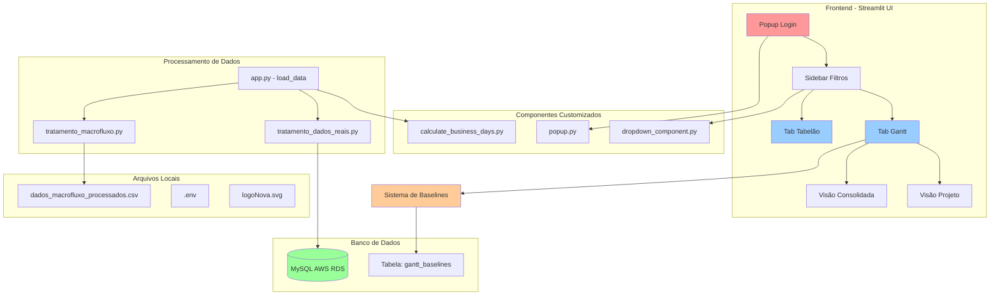
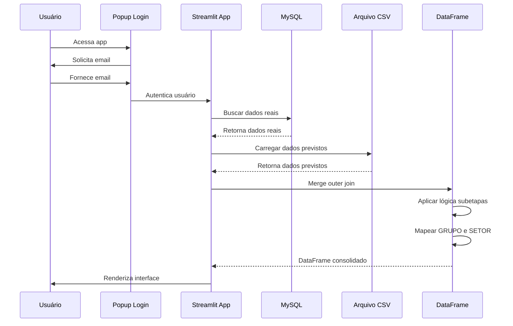
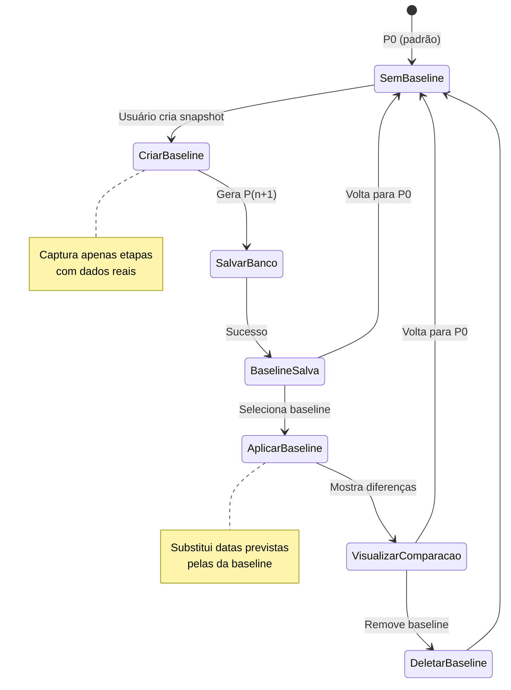
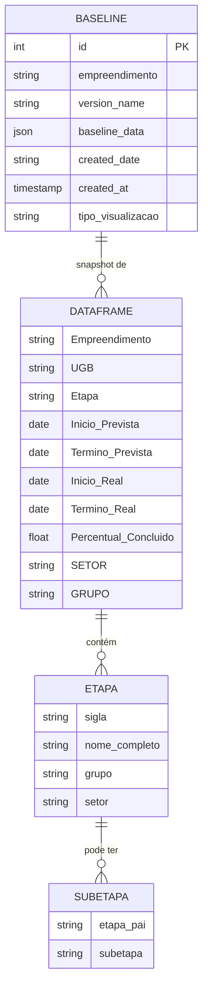
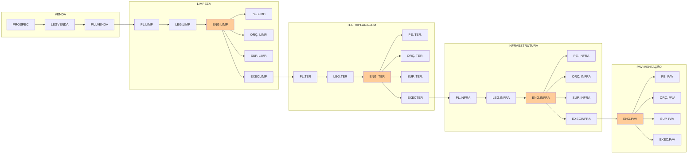
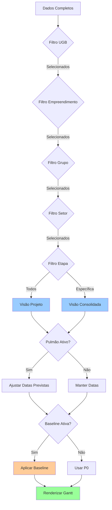
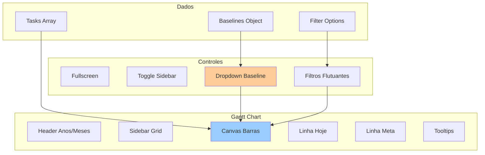
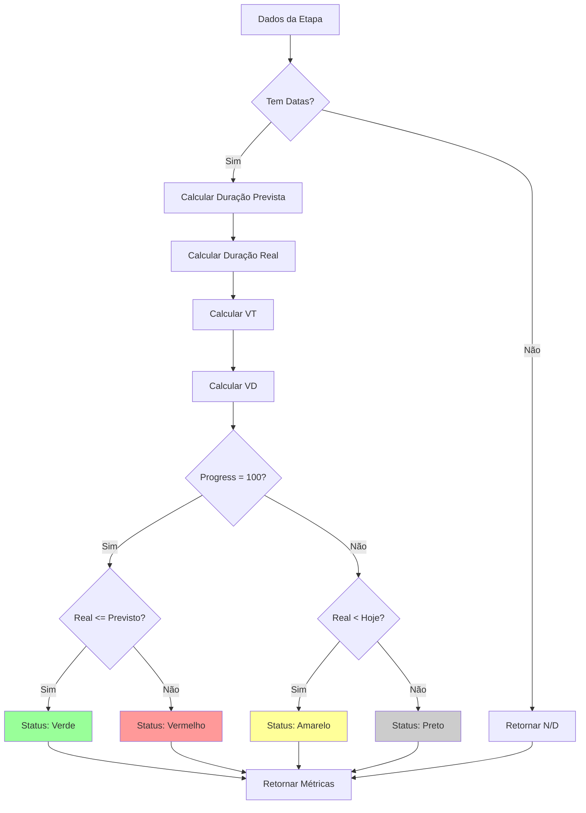
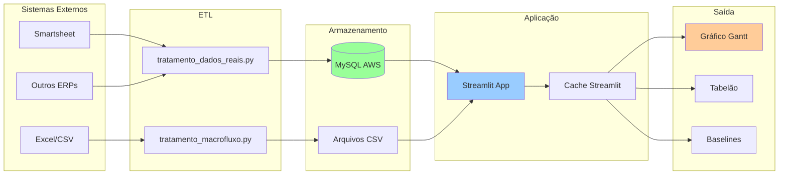

# 🏗️ Diagrama de Arquitetura - Macrofluxo

## Arquitetura Geral do Sistema

## Fluxo de Dados - Carregamento

## Fluxo de Baseline

## Estrutura de Dados - DataFrame

## Hierarquia de Etapas

## Fluxo de Filtros

## Componentes do Gantt

## Cálculo de Métricas

## Integração de Sistemas

---

**Legenda de Cores:**
- 🔴 Vermelho: Autenticação/Login
- 🔵 Azul: Visualizações principais
- 🟢 Verde: Banco de dados/Armazenamento
- 🟠 Laranja: Sistema de baselines
- ⚪ Cinza: Processamento/Lógica
